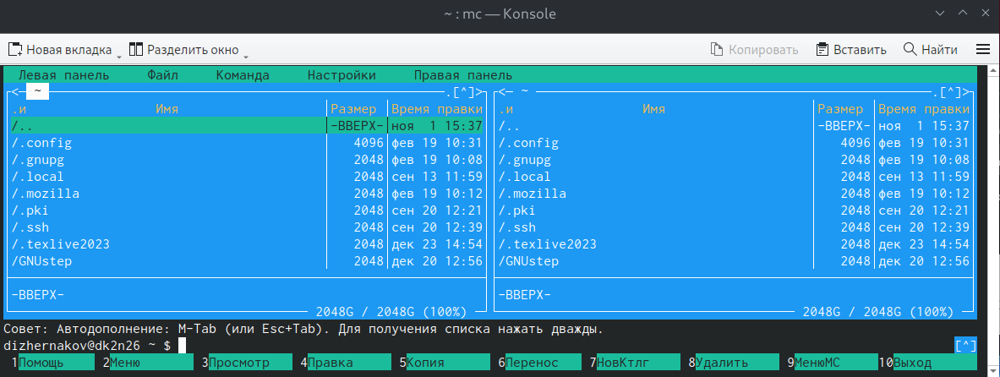
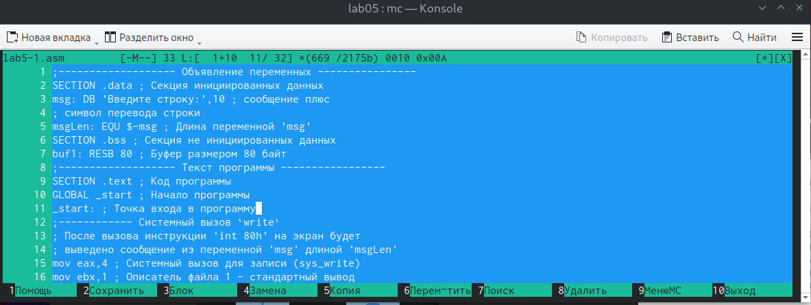

---
## Front matter
title: "Отчёт по лабораторной работе №5"
subtitle: "Дисциплина: архитектура компьютера"
author: "Жернаков Данила Иванович"

## Generic otions
lang: ru-RU
toc-title: "Содержание"

## Bibliography
bibliography: bib/cite.bib
csl: pandoc/csl/gost-r-7-0-5-2008-numeric.csl

## Pdf output format
toc: true # Table of contents
toc-depth: 2
lof: true # List of figures
lot: true # List of tables
fontsize: 12pt
linestretch: 1.5
papersize: a4
documentclass: scrreprt
## I18n polyglossia
polyglossia-lang:
  name: russian
  options:
	- spelling=modern
	- babelshorthands=true
polyglossia-otherlangs:
  name: english
## I18n babel
babel-lang: russian
babel-otherlangs: english
## Fonts
mainfont: PT Serif
romanfont: PT Serif
sansfont: PT Sans
monofont: PT Mono
mainfontoptions: Ligatures=TeX
romanfontoptions: Ligatures=TeX
sansfontoptions: Ligatures=TeX,Scale=MatchLowercase
monofontoptions: Scale=MatchLowercase,Scale=0.9
## Biblatex
biblatex: true
biblio-style: "gost-numeric"
biblatexoptions:
  - parentracker=true
  - backend=biber
  - hyperref=auto
  - language=auto
  - autolang=other*
  - citestyle=gost-numeric
## Pandoc-crossref LaTeX customization
figureTitle: "Рис."
tableTitle: "Таблица"
listingTitle: "Листинг"
lofTitle: "Список иллюстраций"
lotTitle: "Список таблиц"
lolTitle: "Листинги"
## Misc options
indent: true
header-includes:
  - \usepackage{indentfirst}
  - \usepackage{float} # keep figures where there are in the text
  - \floatplacement{figure}{H} # keep figures where there are in the text
---

# Цель работы

Целью данной лабораторной работы является приобретение практических навыков работы в Midnight Commander, освоение инструкций языка ассемблера mov и int.

# Задание

1. Основы работы с mc
2. Структура программы на языке ассемблера NASM
3. Подключение внешнего файла
4. Выполнение заданий для самостоятельной работы

# Теоретическое введение

Midnight Commander (или просто mc) — это программа, которая позволяет просматривать структуру каталогов и выполнять основные операции по управлению файловой системой, т.е. mc является файловым менеджером. Midnight Commander позволяет сделать работу с файлами более удобной и наглядной.
Программа на языке ассемблера NASM, как правило, состоит из трёх секций: секция кода программы (SECTION .text), секция инициированных (известных во время компиляции) данных (SECTION .data) и секция неинициализированных данных (тех, под которые во время компиляции только отводится память, а значение присваивается в ходе выполнения программы) (SECTION .bss).
Для объявления инициированных данных в секции .data используются директивы DB, DW, DD, DQ и DT, которые резервируют память и указывают, какие значения должны храниться в этой памяти:
- DB (define byte) — определяет переменную размером в 1 байт;
- DW (define word) — определяет переменную размеров в 2 байта (слово);
- DD (define double word) — определяет переменную размером в 4 байта (двойное слово);
- DQ (define quad word) — определяет переменную размером в 8 байт (учетве-
рённое слово);
- DT (define ten bytes) — определяет переменную размером в 10 байт. Директивы используются для объявления простых переменных и для объявления массивов. Для определения строк принято использовать директиву DB в связи с особенностями хранения данных в оперативной памяти.
Инструкция языка ассемблера mov предназначена для дублирования данных источника в приёмнике. 
```NASM
mov dst,src
```
Здесь операнд dst — приёмник, а src — источник.
В качестве операнда могут выступать регистры (register), ячейки памяти (memory) и непосредственные значения (const).
Инструкция языка ассемблера intпредназначена для вызова прерывания с
указанным номером. 
```NASM
int n
```
Здесь n — номер прерывания, принадлежащий диапазону 0–255. При программировании в Linux с использованием вызовов ядра sys_calls n=80h (принято задавать в шестнадцатеричной системе счисления).

# Выполнение лабораторной работы
## Основы раработы с mc

 Открываю Midnight Commander, введя в терминал mc (рис. @fig:001).

{#fig:001 width=70%}


Перешел в каталог, создал папку и создал файл (рис.@fig:002)
{#fig:002 width=70%}

## Структура программы на языке ассемблера NASM

 С помощью функциональной клавиши F4 открываю созданный файл для редактирования в редакторе mcedit. Ввожу в файл код программы для запроса строки у пользователя. Далее выхожу из файла (F10), сохраняя изменения (F2). (рис. @fig:004). {#fig:004 width=70%}

 Транслирую текст программы файла в объектный файл командой nasm -f elf lab5-1.asm. Создался объектный файл lab5-1.o. Выполняю компоновку объектного файла с помощью команды ld -m elf_i386 -o lab5-1 lab5-1.o создался исполняемый файл lab5-1. Запускаю. (рис. @fig:005).

{#fig:005 width=70%}
{#fig:006 width=70%}
## Подключение внешнего файла

Скачиваю файл in_out.asm со страницы курса в ТУИС, копирую файл in_out.asm из каталога Загрузки в созданный каталог lab05 и копирую файл lab5-1 с другим именем 

{#fig:007 width=70%}


Изменяю содержимое файла lab5-2.asm во встроенном редакторе mcedit (рис. @fig:008), чтобы в программе использовались подпрограммы из внешнего файла in_out.asm.

{ #fig:008 width=70% }


Транслирую текст программы файла в объектный файл командой nasm -f elf lab5-2.asm. Создался объектный файл lab5-2.o. Выполняю компоновку объектного файла с помощью команды ld -m elf_i386 -o lab5-2 lab5-2.o Создался исполняемый файл lab5-2. Запускаю исполняемый файл (рис. @fig:009).

{#fig:009 width=70%}


Открываю файл lab5-2.asm для редактирования в mcedit функциональной клавишей F4. Изменяю в нем подпрограмму sprintLF на sprint.

Снова транслирую файл, выполняю компоновку созданного объектного файла, запускаю новый исполняемый файл (рис. @fig:010).

{#fig:010 width=70%}

Разница между первым исполняемым файлом lab5-2 и вторым lab5-2-2 в том, что запуск первого запрашивает ввод с новой строки, а программа, которая исполняется при запуске второго, запрашивает ввод без переноса на новую строку, потому что в этом заключается различие между подпрограммами sprintLF и sprint.

## Выполнение заданий для самостоятельной работы

1. Создаю копию файла lab5-1.asm с именем lab5-1-1.asm 
С помощью функциональной клавиши F4 открываю созданный файл для редактирования. Изменяю программу так, чтобы кроме вывода приглашения и запроса ввода, она выводила вводимую пользователем строку. Создаю объектный файл lab5-1-1.o, отдаю его на обработку компоновщику, получаю исполняемый файл lab5-1-1, запускаю полученный исполняемый файл. Программа запрашивает ввод, ввожу свои ФИО, далее программа выводит введенные мною данные(рис. @fig:011).

{#fig:011 width=70%}

Код программы из первого пункта:

```
SECTION .data ; Секция инициированных данных
msg: DB 'Введите строку:',10 
msgLen: EQU $-msg ; Длина переменной 'msg'
SECTION .bss ; Секция не инициированных данных
buf1: RESB 80 ; Буфер размером 80 байт
SECTION .text ; Код программы
GLOBAL _start ; Начало программы
_start: ; Точка входа в программу
mov eax,4 ; Системный вызов для записи (sys_write)
mov ebx,1 ; Описатель файла 1 - стандартный вывод
mov ecx,msg ; Адрес строки 'msg' в 'ecx'
mov edx,msgLen ; Размер строки 'msg' в 'edx'
int 80h ; Вызов ядра
mov eax, 3 ; Системный вызов для чтения (sys_read)
mov ebx, 0 ; Дескриптор файла 0 - стандартный ввод
mov ecx, buf1 ; Адрес буфера под вводимую строку
mov edx, 80 ; Длина вводимой строки
int 80h ; Вызов ядра
mov eax,4 ; Системный вызов для записи (sys_write)
mov ebx,1 ; Описатель файла '1' - стандартный вывод
mov ecx,buf1 ; Адрес строки buf1 в ecx
mov edx,buf1 ; Размер строки buf1
int 80h ; Вызов ядра
mov eax,1 ; Системный вызов для выхода (sys_exit)
mov ebx,0 ; Выход с кодом возврата 0 (без ошибок)
int 80h ; Вызов ядра
```

3. Создаю копию файла lab5-2.asm с именем lab5-2-1.asm. С помощью функциональной клавиши F4 открываю созданный файл для редактирования. Изменяю программу так, чтобы кроме вывода приглашения и запроса ввода, она выводила вводимую пользователем строку 

4. Создаю объектный файл lab5-2-1.o, отдаю его на обработку компоновщику, получаю исполняемый файл lab5-2-1, запускаю полученный исполняемый файл. Программа запрашивает ввод без переноса на новую строку, ввожу свои ФИО, далее программа выводит введенные мною данные (рис. @fig:012).

{#fig:012 width=70%}

Код программы из третьего пункта:

```%include 'in_out.asm'
SECTION .data ; Секция инициированных данных
msg: DB 'Введите строку: ',0h ; сообщение
SECTION .bss ; Секция не инициированных данных
buf1: RESB 80 ; Буфер размером 80 байт
SECTION .text ; Код программы
GLOBAL _start ; Начало программы
_start: ; Точка входа в программу
mov eax, msg ; запись адреса выводимого сообщения в `EAX`
call sprint ; вызов подпрограммы печати сообщения
mov ecx, buf1 ; запись адреса переменной в `EAX`
mov edx, 80 ; запись длины вводимого сообщения в `EBX`
call sread ; вызов подпрограммы ввода сообщения
mov eax,4 ; Системный вызов для записи (sys_write)
mov ebx,1 ; Описатель файла '1' - стандартный вывод
mov ecx,buf1 ; Адрес строки buf1 в ecx
int 80h ; Вызов ядра
call quit ; вызов подпрограммы завершения
```

# Выводы

При выполнении данной лабораторной работы я приобрёл практические навыки работы в Midnight Commander, а также освоил инструкции языка ассемблера mov и int.

