---
## Front matter
title: "Отчёт по лабораторной работе №7"
subtitle: "Дисциплина:архитектура компьютера"
author: "Жернаков Данила Иванович"

## Generic otions
lang: ru-RU
toc-title: "Содержание"

## Bibliography
bibliography: bib/cite.bib
csl: pandoc/csl/gost-r-7-0-5-2008-numeric.csl

## Pdf output format
toc: true # Table of contents
toc-depth: 2
lof: true # List of figures
lot: true # List of tables
fontsize: 12pt
linestretch: 1.5
papersize: a4
documentclass: scrreprt
## I18n polyglossia
polyglossia-lang:
  name: russian
  options:
	- spelling=modern
	- babelshorthands=true
polyglossia-otherlangs:
  name: english
## I18n babel
babel-lang: russian
babel-otherlangs: english
## Fonts
mainfont: PT Serif
romanfont: PT Serif
sansfont: PT Sans
monofont: PT Mono
mainfontoptions: Ligatures=TeX
romanfontoptions: Ligatures=TeX
sansfontoptions: Ligatures=TeX,Scale=MatchLowercase
monofontoptions: Scale=MatchLowercase,Scale=0.9
## Biblatex
biblatex: true
biblio-style: "gost-numeric"
biblatexoptions:
  - parentracker=true
  - backend=biber
  - hyperref=auto
  - language=auto
  - autolang=other*
  - citestyle=gost-numeric
## Pandoc-crossref LaTeX customization
figureTitle: "Рис."
tableTitle: "Таблица"
listingTitle: "Листинг"
lofTitle: "Список иллюстраций"
lotTitle: "Список таблиц"
lolTitle: "Листинги"
## Misc options
indent: true
header-includes:
  - \usepackage{indentfirst}
  - \usepackage{float} # keep figures where there are in the text
  - \floatplacement{figure}{H} # keep figures where there are in the text
---

# Цель работы

Изучение команд условного и безусловного переходов. Приобретение навыков написания программ с использованием переходов. Знакомство с назначением и структурой файла листинга.

# Задание

 1. Реализация переходов в NASM
 2. Изучение структуры файла листинга
 3. Задание для самостоятельной работы

# Теоретическое введение

Для реализации ветвлений в ассемблере используются так называемые команды передачи
управления или команды перехода. Можно выделить 2 типа переходов:

• Условный переход – выполнение или не выполнение перехода в определенную точку
программы в зависимости от проверки условия.

• Безусловный переход – выполнение передачи управления в определенную точку про-
граммы без каких-либо условий.

# Выполнение лабораторной работы

## Реализация переходов в NASM
Создаю каталог для программ для лабораторной работе №7, перехожу в него и создаю файл lab7-1.asm (рис. @fig:001).

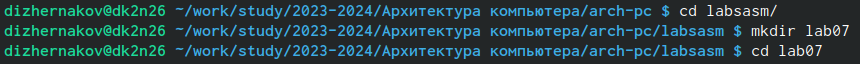{#fig:001 width=70%}


Ввожу в файл lab7-1.asm текст программы с использованием функции jmp (рис. @fig:002).
Создаю исполняемый файл и запускаю его (рис. @fig:003).

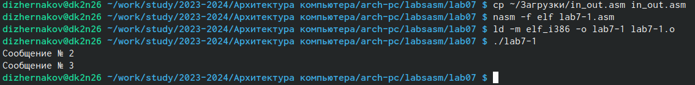{#fig:003 width=70%}


Изменяю программу таким образом, чтобы она выводила сначала  ‘Сообщение No 2’, потом ‘Сообщение
No 1’ и завершала работу (рис. @fig:004).

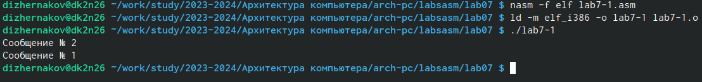{#fig:004 width=70%}

Изменяю программу таким образом, чтобы она выводила сначала  ‘Сообщение No 3’, потом  ‘Сообщение No 2’, потом ‘Сообщение No 1’ и завершала работу (рис. @fig:006).

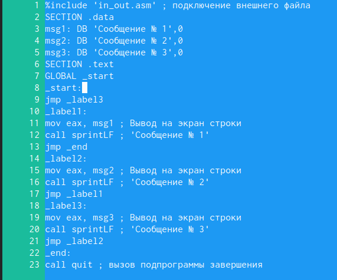{#fig:006 width=70%}


Создаю исполняемый файл и проверяю корректность работы программы (рис. @fig:007). Программа отработала корректно.

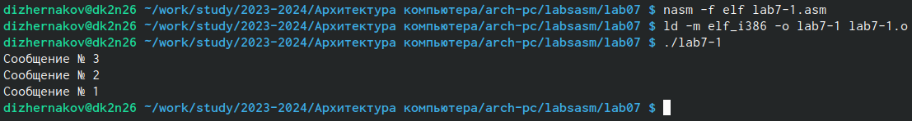{#fig:007 width=70%}


Создаю файл lab7-2.asm
Ввожу в созданны файл текст программы, которая определяет и выводит на экран наибольшую из 3 целочисленных переменных:A, B и C
Создаю исполняемый файл и проверяю его работу для разных значений B (рис. @fig:010). Программа сработала корректно.

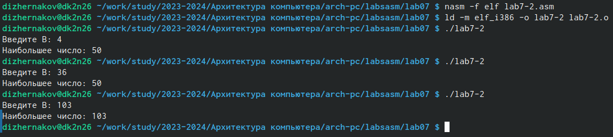{#fig:010 width=70%}

## Изучение структуры файла листинга
Создание файла листинга и его просмотр в текстовом редакторе(рис. @fig:011).

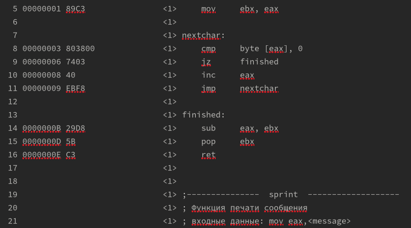{#fig:011 width=70%}
{#fig:011 width=70%}

1. В строке 5 содержится собственно номер строки[5], адрес[00000001], машинный код[89C3] и содержимое строки кода[mov ebx, eax].
2. В строке 11 содержится собственно номер строки[11], адрес[00000009], машинный код[EBF8] и содержимое строки кода[jmp nextchar].
3. В строке 14 содержится собственно номер строки[14], адрес[0000000B], машинный код[29D8] и содержимое строки кода[sub eax, ebx].


Открываю файл lab7-2.asm и удаляю в инструкции cmp вторгй операнд (рис. @fig:012).
Открытие файла листинга после трансляции (рис. @fig:013). Если в коде появляется ошибка, то её описание появится в файле листинга.

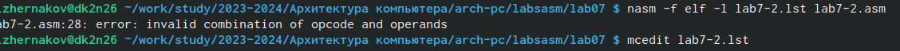{#fig:013 width=70%} 
{#fig:014 width=70%} 

## Выполнение заданий для самостоятельной работы (вар. 16)
Создаю файл lab7-3.asm, пишу в нём программу для нахождения наименьшей из трёх целочисленных переменных a, b и c.

Текст программы в файле lab7-3.asm:
```
%include 'in_out.asm'
section .data
msg1 db 'Введите B: ',0h
msg2 db "Наибольшее число из 44, 74 и 17 - это ",0h
A dd 44
B dd 74
C dd 17
section .bss
max resb 10
section .text
global _start
_start:
; ---------- Записываем 'A' в переменную 'max'
mov ecx,[A] ; 'ecx = A'
mov [max],ecx ; 'max = A'
; ---------- Сравниваем 'A' и 'B'
cmp ecx, [B]
jg check_C ; если 'A>B', то переход на метку 'check_C',
mov ecx,[B] ; иначе 'ecx = B'
mov [max],ecx ; 'max = B'
check_C:
mov eax,max
mov ecx,[max]
cmp ecx,[C] ; Сравниваем 'max(A,B)' и 'C'
jg fin ; если 'max(A,B)>C', то переход на 'fin',
mov ecx,[C] ; иначе 'ecx = C'
mov [max],ecx
; ---------- Вывод результата
fin:
mov eax, msg2
call sprint ; Вывод сообщения 'Наибольшее число: '
mov eax,[max]
call iprintLF ; Вывод 'max(A,B,C)'
call quit ; Выход
```
Создаю исполняемый файл и проверяю его работу (рис. @fig:014). Программа отработала корректно.

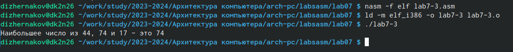{#fig:014 width=70%}


Создаю файл lab7-4.asm, пишу в нём програму, которая для введённых с клавиатуры значений x и a вычисляет значение функции f(x), которая равна xa при x>=4, когда x < 4, то х+4  и выводит результат вычислений.

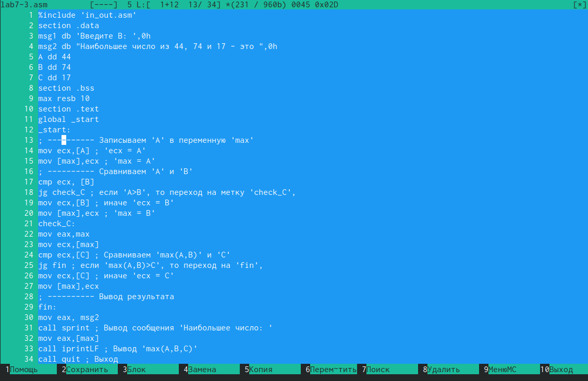{#fig:014 width=70%}


Создаю исполняемый файл и проверяю его работу для пар x и a (1,1) и (7,1) (рис. @fig:015). Программа отработала верно.

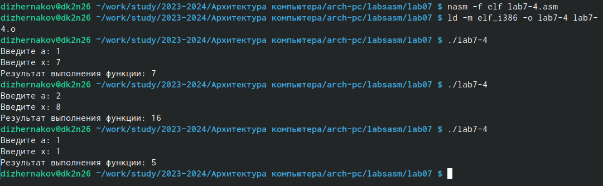{#fig:015 width=70%}


# Выводы

В ходе выполнения лабораторной работы я освоил принципы условного и безусловного перехода в NASM.

