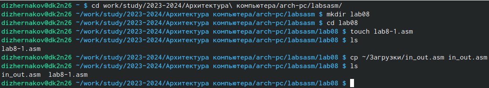
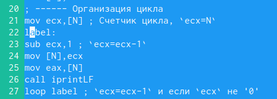
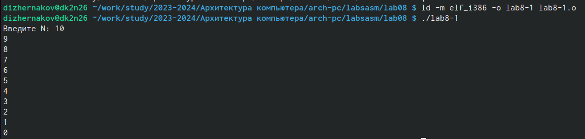
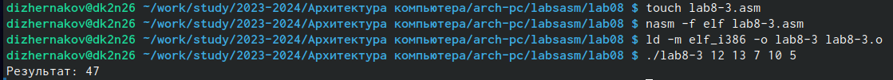
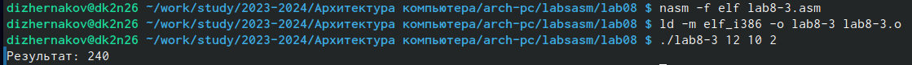
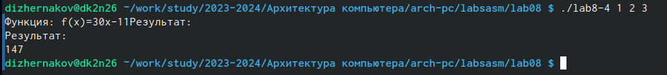

---
## Front matter
title: "Отчёт по лабораторной работе №8"
subtitle: "Дисциплина:архитектура компьютера"
author: "Жернаков Данила Иванович"

## Generic otions
lang: ru-RU
toc-title: "Содержание"

## Bibliography
bibliography: bib/cite.bib
csl: pandoc/csl/gost-r-7-0-5-2008-numeric.csl

## Pdf output format
toc: true # Table of contents
toc-depth: 2
lof: true # List of figures
lot: true # List of tables
fontsize: 12pt
linestretch: 1.5
papersize: a4
documentclass: scrreprt
## I18n polyglossia
polyglossia-lang:
  name: russian
  options:
	- spelling=modern
	- babelshorthands=true
polyglossia-otherlangs:
  name: english
## I18n babel
babel-lang: russian
babel-otherlangs: english
## Fonts
mainfont: PT Serif
romanfont: PT Serif
sansfont: PT Sans
monofont: PT Mono
mainfontoptions: Ligatures=TeX
romanfontoptions: Ligatures=TeX
sansfontoptions: Ligatures=TeX,Scale=MatchLowercase
monofontoptions: Scale=MatchLowercase,Scale=0.9
## Biblatex
biblatex: true
biblio-style: "gost-numeric"
biblatexoptions:
  - parentracker=true
  - backend=biber
  - hyperref=auto
  - language=auto
  - autolang=other*
  - citestyle=gost-numeric
## Pandoc-crossref LaTeX customization
figureTitle: "Рис."
tableTitle: "Таблица"
listingTitle: "Листинг"
lofTitle: "Список иллюстраций"
lotTitle: "Список таблиц"
lolTitle: "Листинги"
## Misc options
indent: true
header-includes:
  - \usepackage{indentfirst}
  - \usepackage{float} # keep figures where there are in the text
  - \floatplacement{figure}{H} # keep figures where there are in the text
---

# Цель работы

Приобретение навыков написания программ с использованием циклов и обработкой
аргументов командной строки.

# Задание

1. Реализация циклов в NASM
2. Обработка аргументов командной строки
3. Задание для самостоятельной работы

# Теоретическое введение

Цикл в программировании — это управляющая конструкция, которая заставляет какой-то блок кода выполняться несколько раз.

# Выполнение лабораторной работы

## Реализация циклов в NASM

 Создаю каталог для программ для лабораторной работы №8, перехожу в него и создаю файл lab8-1.asm, в который ввожу программу вывода значений регистра ecx (рис. @fig:001).

{#fig:001 width=70%}


Создаю исполняемый файл и запускаю его (рис. @fig:002). Программа отработала корректно.

{#fig:002 width=70%}


Изменяю текст программы добавив изменение значения регистра ecx в цикле (рис. @fig:003).

{#fig:003 width=70%}


Создаю исполняемый файл и запускаю его (рис. @fig:004). Число проходов цикла равно N/2.

{#fig:004 width=70%}


Вношу изменения в текст программы добавив команды push и pop для сохранения значения счётчика loop(рис. @fig:005).

Создаю исполняемый файл и проверяю его работу (рис. @fig:006). Число проходов соответствует значению N введённому с клавиатуры.

{#fig:006 width=70%}

## Обработка аргументов командной строки

Создаю файл lab8-2.asm и ввожу в него программу обработки аргументов командной строки (рис. @fig:007).

![Запуск исполняемого файла]](image/6.png){#fig:007 width=70%}

Создаю файл lab8-3.asm и ввожу в него программу вычисления суммы аргументов командной строки (рис. @fig:009).
Создаю исполняемый файл и запускаю его, указав аргументы 12, 13, 7, 10, 5 (рис. @fig:010). Программа отработала корректно.
{#fig:009 width=70%}
Создаю файл lab8-3-1.asm и ввожу в него программу вычисления произведения аргументов командной строки (рис. @fig:011).Создаю исполняемый файл и запускаю его, указав аргументы 12 10 2. Программа отработала корректно.

{#fig:011 width=70%}


Текст программы из файла lab8-3-1.asm:

```NASM
%include "in_out.asm"
SECTION .data
msg db 'результат: '
SECTION .text
GLOBAL _start

_start:
pop ecx
pop edx
sub ecx,1
mov esi,1

next:
cmp ecx,0
jz _end

pop eax
call atoi
mul esi
mov esi, eax

loop next

_end:
mov eax, msg
call sprint
mov eax, esi
call iprintLF
call quit
```

## Задание для самостоятельной работы (Вариант 5)

Создаю файл lab8-4.asm и ввожу текст программы для вычисления суммы значений функции f(x)=30(30 1) (рис. @fig:013).
Создаю исполняемый файл и запускаю исполняемый файл с разными аргументами (рис. @fig:014). Программа отработала корректно.
{#fig:013 width=70%}

Текст программы из файла lab8-4.asm:
```
%include 'in_out.asm'
SECTION .data
msg0 db "Функция: f(x)=30x-11"
msg1 db "Результат: ",0
SECTION .text
global _start
_start:
pop ecx
pop edx
sub ecx,1 
mov esi, 0
next:
cmp ecx,0h 
jz _end
pop eax
call atoi 
mov edx, 30
mul edx
sub eax,11
add esi,eax 
loop next 
_end:
mov eax, msg0
call sprintLF
mov eax, msg1
call sprintLF
mov eax, esi
call iprintLF 
call quit 


```
# Выводы

Были получены навыки по организации циклов и работе со стеком на языке NASM.

# Список литературы{.unnumbered}

1. [Лабораторная работа №8](https://esystem.rudn.ru/pluginfile.php/2089548/mod_resource/content/0/%D0%9B%D0%B0%D0%B1%D0%BE%D1%80%D0%B0%D1%82%D0%BE%D1%80%D0%BD%D0%B0%D1%8F%20%D1%80%D0%B0%D0%B1%D0%BE%D1%82%D0%B0%20%E2%84%968.%20%D0%9F%D1%80%D0%BE%D0%B3%D1%80%D0%B0%D0%BC%D0%BC%D0%B8%D1%80%D0%BE%D0%B2%D0%B0%D0%BD%D0%B8%D0%B5%20%D1%86%D0%B8%D0%BA%D0%BB%D0%B0.%20%D0%9E%D0%B1%D1%80%D0%B0%D0%B1%D0%BE%D1%82%D0%BA%D0%B0%20%D0%B0%D1%80%D0%B3%D1%83%D0%BC%D0%B5%D0%BD%D1%82%D0%BE%D0%B2%20%D0%BA%D0%BE%D0%BC%D0%B0%D0%BD%D0%B4%D0%BD%D0%BE%D0%B9%20%D1%81%D1%82%D1%80%D0%BE%D0%BA%D0%B8..pdf)
