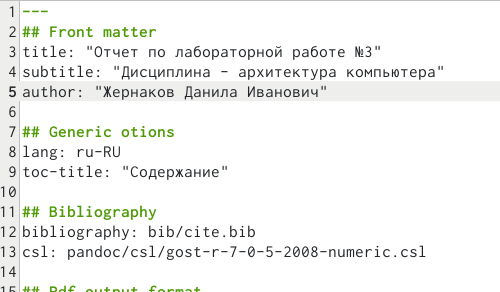
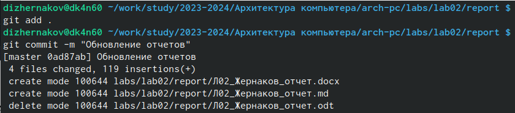

---
## Front matter
title: "Отчет по лабораторной работе №3"
subtitle: "Дисциплина - архитектура компьютера"
author: "Жернаков Данила Иванович"

## Generic otions
lang: ru-RU
toc-title: "Содержание"

## Bibliography
bibliography: bib/cite.bib
csl: pandoc/csl/gost-r-7-0-5-2008-numeric.csl

## Pdf output format
toc: true # Table of contents
toc-depth: 2
lof: true # List of figures
lot: true # List of tables
fontsize: 12pt
linestretch: 1.5
papersize: a4
documentclass: scrreprt
## I18n polyglossia
polyglossia-lang:
  name: russian
  options:
	- spelling=modern
	- babelshorthands=true
polyglossia-otherlangs:
  name: english
## I18n babel
babel-lang: russian
babel-otherlangs: english
## Fonts
mainfont: PT Serif
romanfont: PT Serif
sansfont: PT Sans
monofont: PT Mono
mainfontoptions: Ligatures=TeX
romanfontoptions: Ligatures=TeX
sansfontoptions: Ligatures=TeX,Scale=MatchLowercase
monofontoptions: Scale=MatchLowercase,Scale=0.9
## Biblatex
biblatex: true
biblio-style: "gost-numeric"
biblatexoptions:
  - parentracker=true
  - backend=biber
  - hyperref=auto
  - language=auto
  - autolang=other*
  - citestyle=gost-numeric
## Pandoc-crossref LaTeX customization
figureTitle: "Рис."
tableTitle: "Таблица"
listingTitle: "Листинг"
lofTitle: "Список иллюстраций"
lotTitle: "Список таблиц"
lolTitle: "Листинги"
## Misc options
indent: true
header-includes:
  - \usepackage{indentfirst}
  - \usepackage{float} # keep figures where there are in the text
  - \floatplacement{figure}{H} # keep figures where there are in the text
---

# Цель работы

Целью данной лабораторной работы является освоение процедуры оформления отчетов с помощью легковесного языка разметки Markdown.

# Задание

1. Заполнение отчета по выполнению лабораторной работы №3 с помощью языка разметки Markdown
2. Задание для самостоятельной работы

# Теоретическое введение

Markdown - легковесный язык разметки, созданный с целью обозначения форматирования в простом тексте, с максимальным сохранением его читаемости человеком, и пригодный для машинного преобразования в языки для продвинутых публикаций. 
Внутритекстовые формулы делаются аналогично формулам LaTeX.
В Markdown вставить изображение в документ можно с помощью непосредственного указания адреса изображения.
Синтаксис Markdown для встроенной ссылки состоит из части [link text], представляющей текст гиперссылки, и части (file-name.md) – URL-адреса или имени файла, на который дается ссылка.
Markdown поддерживает как встраивание фрагментов кода в предложение, так и их размещение между предложениями в виде отдельных огражденных блоков. Огражденные блоки кода — это простой способ выделить синтаксис для фрагментов кода.

# Выполнение лабораторной работы

## Заполнение отчета по выполнению лабораторной работы №4 с помощью языка разметки Markdown

Открываю терминал. Перехожу в каталог курса, сформированный при выполненнии прошлой лаборатной работы и обновляю локальный репозиторий, скачав изменения из удаленного репозитория с помощью команды git pull (рис. @fig:001)..

{ #fig:001 width=70% }

Перехожу в каталог с шаблоном отчета по лабораторной работе №3 и компилирую шаблон с использованием Makefile, вводя команду make (рис. @fig:002).

{ #fig:002 width=70% }

Открываю сгенерированный файл report.docx и report.pdf (рис. @fig:003).

{ #fig:003 width=70% }

Удаляю полученные файлы с использованием Makefile, вводя команду make clean (рис. @fig:004). С помощью команды ls проверяю, удалились ли созданные файлы.

{ #fig:004 width=70% }

Открываю файл report.md с помощью любого текстового редактора mousepad (рис. @fig:006).

{ #fig:006 width=70% }

Я хочу, чтобы у меня на всякий случай сохранился шаблон отчета, поэтому копирую файл с новым названием с помощью утилиты cp (рис. @fig:007).

{ #fig:007 width=70% }

Начинаю заполнять отчет с помощью языка разметки Markdown в скопированном файле (рис. @fig:008).

{ #fig:008 width=70% }

Компилирую файл с отчетом. Загружаю отчет на GitHub.

## Задание для самостоятельной работы

1. Перехожу в директорию lab02/report с помощью cd, чтобы там заполнять отчет по второй лабораторной работе и копирую файл report.md с новым именем для заполненния отчета (рис. @fig:9).

{ #fig:9 width=70% }

Открываю файл с помощью текстового редактора mousepad и начинаю заполнять отчет (рис. @fig:10).

{ #fig:10 width=70% }

Удаляю предыдущий файл отчета, чтобы при компиляции он мне не мешал и компилирую файл с отчетом по лабораторной работе (рис. @fig:11).

{ #fig:11 width=70% }

2. Удаляю лишние сгенерированные файлы report.docx и report.pdf (@fig:12).

{ #fig:12 width=70% }

Добавляю изменения на GitHub с помощью комнадой git add и сохраняю изменения с помощью commit (@fig:13).

{ #fig:13 width=70% }

Отправлялю файлы на сервер с помощью команды git push (@fig:14).

{ #fig:14 width=70% }

# Выводы

В результате выполнения данной лабораторной работы я освоила процедуры оформления отчетов с помощью легковесного языка разметки Markdown.

# Список литературы

1. [Архитектура ЭВМ](https://esystem.rudn.ru/pluginfile.php/1584625/mod_resource/content/1/%D0%9B%D0%B0%D0%B1%D0%BE%D1%80%D0%B0%D1%82%D0%BE%D1%80%D0%BD%D0%B0%D1%8F%20%D1%80%D0%B0%D0%B1%D0%BE%D1%82%D0%B0%20%E2%84%964.pdf)

