---
## Front matter
title: "Отчёт по лабораторной работе №9"
subtitle: "Дисциплина: Архитектура компьютера"
author: "Жернаков Данила Иванович"

## Generic otions
lang: ru-RU
toc-title: "Содержание"

## Bibliography
bibliography: bib/cite.bib
csl: pandoc/csl/gost-r-7-0-5-2008-numeric.csl

## Pdf output format
toc: true # Table of contents
toc-depth: 2
lof: true # List of figures
lot: true # List of tables
fontsize: 12pt
linestretch: 1.5
papersize: a4
documentclass: scrreprt
## I18n polyglossia
polyglossia-lang:
  name: russian
  options:
	- spelling=modern
	- babelshorthands=true
polyglossia-otherlangs:
  name: english
## I18n babel
babel-lang: russian
babel-otherlangs: english
## Fonts
mainfont: PT Serif
romanfont: PT Serif
sansfont: PT Sans
monofont: PT Mono
mainfontoptions: Ligatures=TeX
romanfontoptions: Ligatures=TeX
sansfontoptions: Ligatures=TeX,Scale=MatchLowercase
monofontoptions: Scale=MatchLowercase,Scale=0.9
## Biblatex
biblatex: true
biblio-style: "gost-numeric"
biblatexoptions:
  - parentracker=true
  - backend=biber
  - hyperref=auto
  - language=auto
  - autolang=other*
  - citestyle=gost-numeric
## Pandoc-crossref LaTeX customization
figureTitle: "Рис."
tableTitle: "Таблица"
listingTitle: "Листинг"
lofTitle: "Список иллюстраций"
lotTitle: "Список таблиц"
lolTitle: "Листинги"
## Misc options
indent: true
header-includes:
  - \usepackage{indentfirst}
  - \usepackage{float} # keep figures where there are in the text
  - \floatplacement{figure}{H} # keep figures where there are in the text
---

# Цель работы

Приобретение навыков написания программ с использованием подпрограмм. 
Знакомство с методами отладки при помощи GDB и его основными возможностями.

# Выполнение лабораторной работы

Создал каталог для выполнения лабораторной работы №9, перешел в него и создал файл (рис. @fig:001).

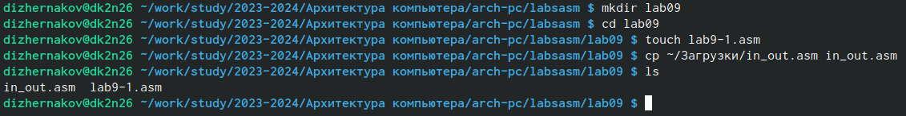{#fig:001 width=70%}

Создал исполняемый файл и проверил его работу (рис. @fig:003).

{#fig:003 width=70%}

Изменил текст программы, добавив подпрограмму _subcalcul в подпрограмму _calcul, для вычисления выражения f(g(x)), 
где x вводится с клавиатуры, f(x)=2x+7, g(x)=3x-1.

Создал исполняемый файл и проверил его работу (рис. @fig:005).

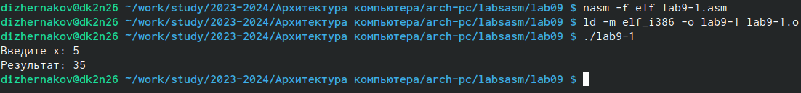{#fig:005 width=70%}

Создал файл lab09-2.asm с текстом программы из листинга 9.2.
Получил исполняемый файл (рис. @fig:007).

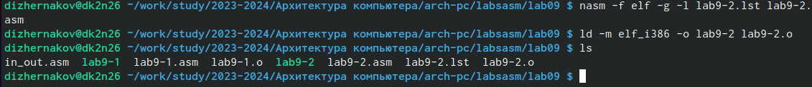{#fig:007 width=70%}

Загрузил исполняемый файл в отладчик gdb (рис. @fig:008).

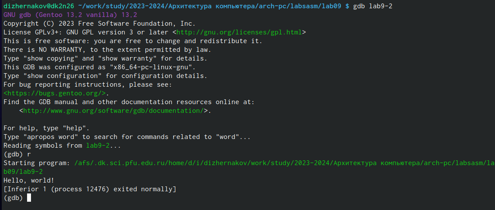{#fig:008 width=70%}

Для более подробного анализа программы установил брейкпоинт на метку _start, с которой начинается 
выполнение любой ассемблерной программы, и запустил её (рис. @fig:010).

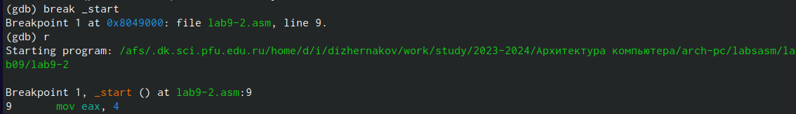{#fig:010 width=70%}

Посмотрел дисассимилированный код программы с помощью команды disassemble, начиная с метки _start (рис. @fig:011).

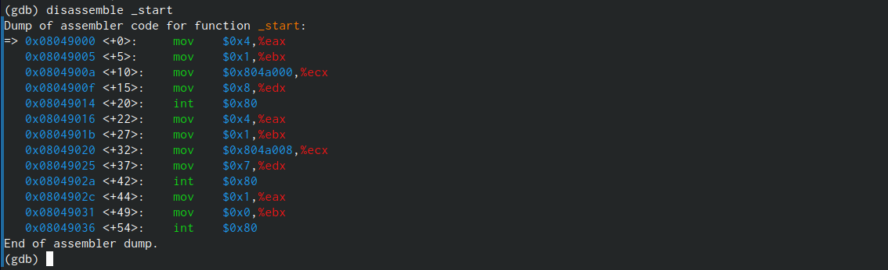{#fig:011 width=70%}

Переключение на отображение команд с Intelовским синтаксисом (рис. @fig:012).

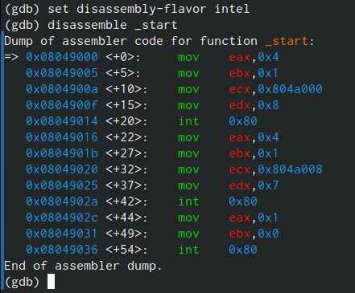{#fig:012 width=70%}

Включил режим псевдографики для более удобного анализа программы: layout asm и layout regs. (рис. @fig:013).

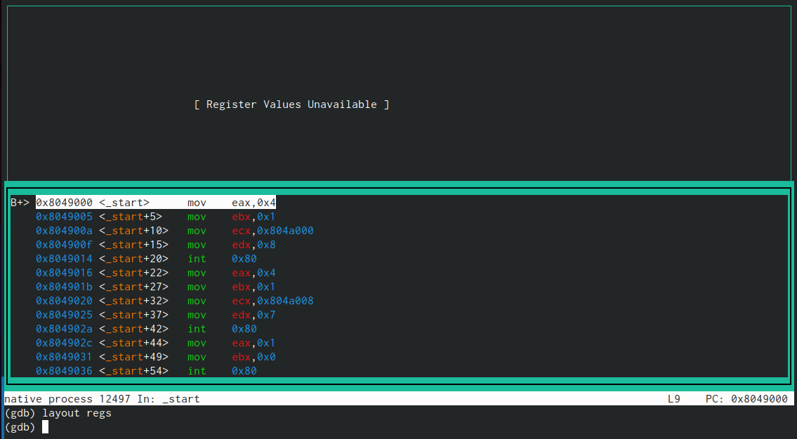{#fig:014 width=70%}

Проверил точку останова по имени метки (рис. @fig:015).

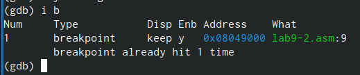{#fig:015 width=70%}

Определила адрес предпоследней инструкции (mov ebx,0x0) и установила точку останова (рис. @fig:016).

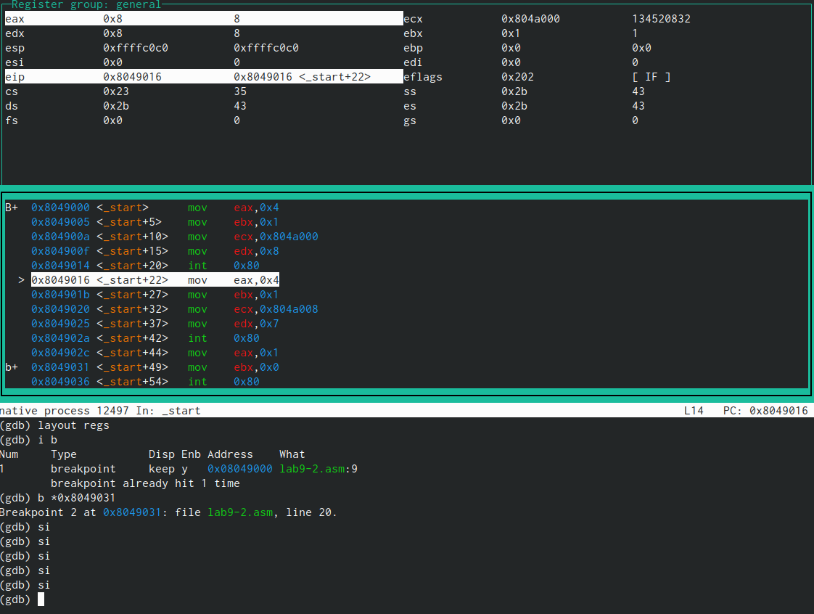{#fig:016 width=70%}

Посмотрел значение переменной msg1 по имени (рис. @fig:019).

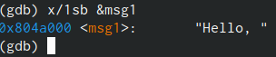{#fig:019 width=70%}

Посмотрел значение переменной msg2 по адресу (рис. @fig:020).

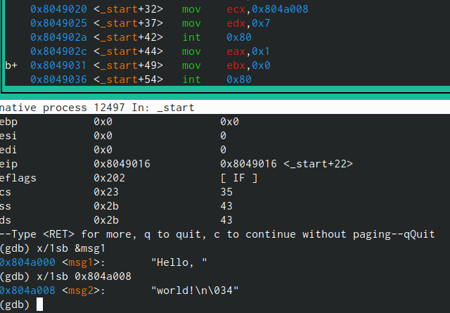{#fig:020 width=70%}

Изменил первый символ переменной msg1.

Заменил некоторый символ во второй переменной msg2 (рис. @fig:022).

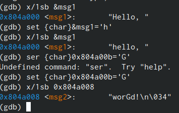{#fig:022 width=70%}

Вывел в различных форматах (в шестнадцатеричном формате, в двоичном формате и
в символьном виде) значение регистра eаx (рис. @fig:023).

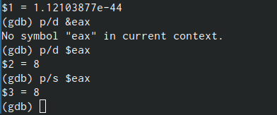{#fig:023 width=70%}

Завершил выполнение программы с помощью команды continue (сокращенно c) или
stepi (сокращенно si) и вышла из GDB с помощью команды quit (сокращенно q).

Скопировал файл lab8-2.asm, созданный при выполнении лабораторной работы №8,
с программой выводящей на экран аргументы командной строки (Листинг 8.2) в файл с
именем lab09-3.asm (рис. @fig:025).

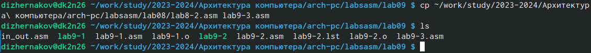{#fig:025 width=70%}

Создал исполняемый файл (рис. @fig:026).

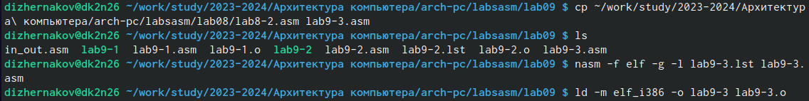{#fig:026 width=70%}

Загрузил исполняемый файл в отладчик, указав аргументы (рис. @fig:027).

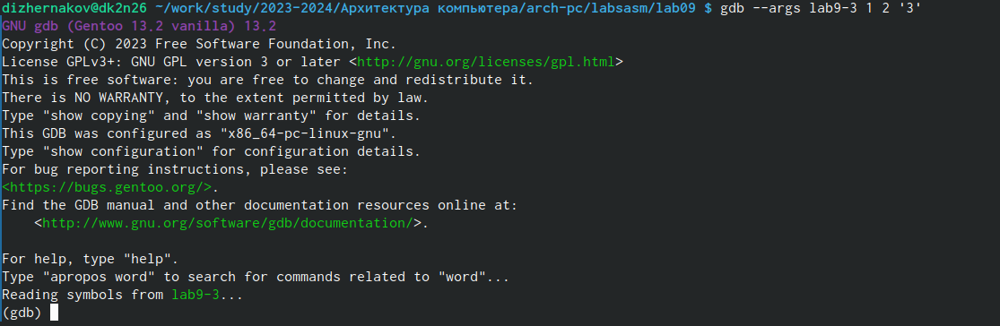{#fig:027 width=70%}

Для начала установлю точку останова перед первой инструкцией в программе и запущу ее (рис. @fig:028).

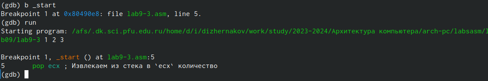{#fig:028 width=70%}

Адрес вершины стека храниться в регистре esp, и по этому адресу располагается число,
равное количеству аргументов командной строки (включая имя программы)
Посмотрел остальные позиции стека (рис. @fig:030).

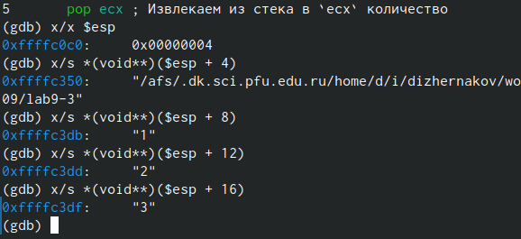{#fig:030 width=70%}

Шаг изменения адреса равен 4, потому что число аргументов равно 4.

# Самостоятельная работа

Создал файл для самостоятельной работы 
Преобразовал программу из лабораторной работы №8 (Задание №1 для самостоятельной работы), реализовав вычисление значения функции 𝑓(𝑥) как подпрограмму (рис. @fig:032).

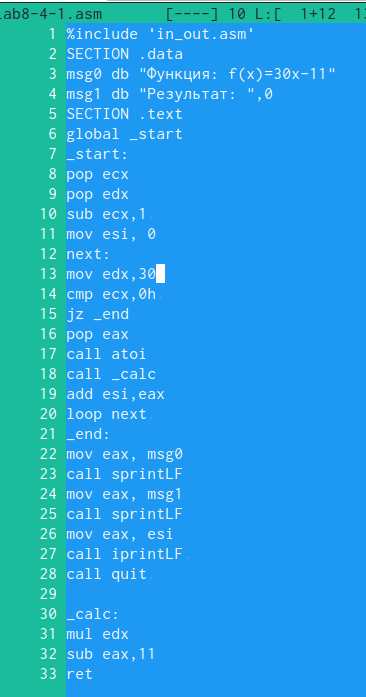{#fig:032 width=70%}

Получил верный ответ (рис. @fig:033).

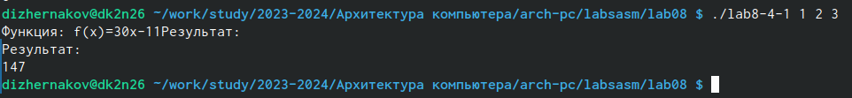{#fig:033 width=70%}

Создал файл для второго задания самостоятельной работы.
Ввел программу из листинга 9.3.
Попробовал запустить программу.
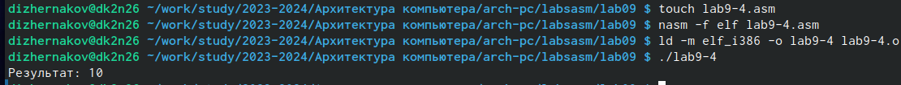{#fig:036 width=70%}

Просматрел дисассимилированный код программы, поставил точку останова перед инструкцией _start
и открыл значения регистров на этапе первого сложения (рис. @fig:037).

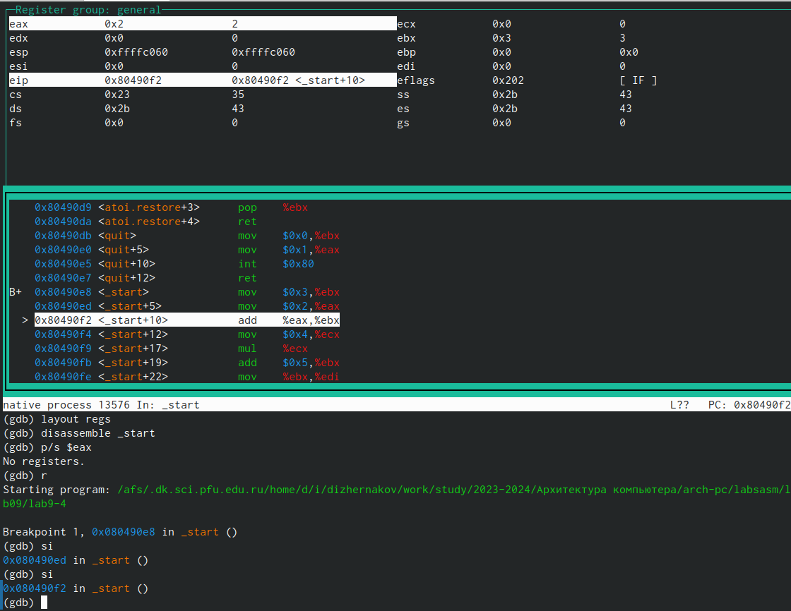{#fig:037 width=70%}

Регистр ecx со значением 4 умножается не на ebx,сложенным c eax, а только с eax со значением 2. Меняю (рис. @fig:038).

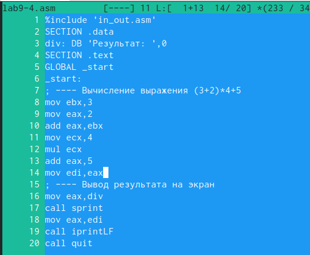{#fig:038 width=70%}

Получаю верный ответ (рис. @fig:039).

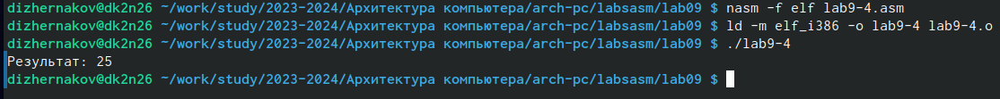{#fig:039 width=70%}

# Выводы

В ходе работы я приобрел навыки написания программ с использованием подпрограмм, 
познакомился с методами отладки при помощи GDB и его основными возможностями.

# Список литературы{.unnumbered}

::: {#refs}
:::

